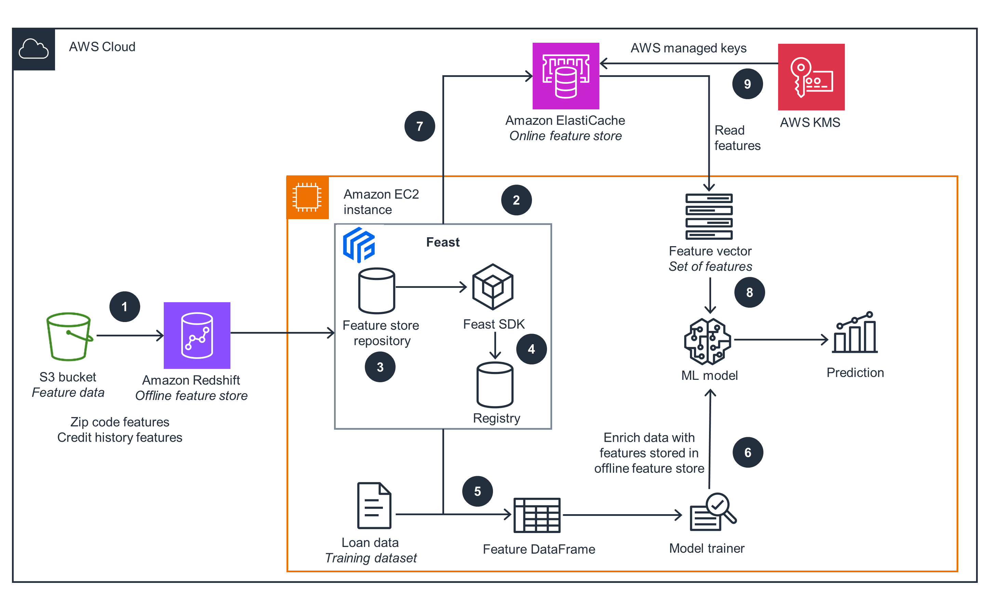
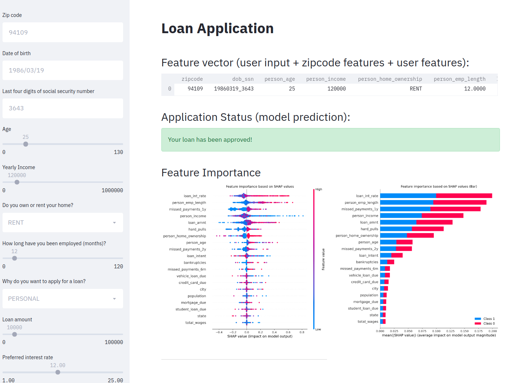

# Guidance for Ultra Low Latency Machine Learning Feature Stores on AWS

## Table of Content 

1. [Overview](#Overview)
    - [Cost](#cost)
2. [Prerequisites](#Prerequisites)
    - [Operating System](#Operating-system)
    - [Third Party tools](#Third-party-tools)
    - [Project Specific Dependencies](Project-specific-dependencies)
3. [Deployment Steps](#Deployment-Steps)
4. [Deployment Validation](#Deployment-Validation)
5. [Running the Guidance](#Running-the-Guidance)
6. [Next Steps](#Next-Steps)
7. [Cleanup](#Cleanup)
8. [Notices](#Notices)
9. [Authors](#Authors)


## Overview

Feature stores are one of the most important pieces of infrastructure in the ML space that serve to support the ease of model deployment. They act as source of truth for available features for training and inferencing use cases. Feature stores operate as a centralized repository that can be used by a model to retrieve features in a standardized format, acting as a data transformation service to make these features ready to use.

We explore how our customers are building online feature stores on AWS with Amazon ElastiCache to support mission-critical ML use cases that require ultra-low latency. We will cover reference architecture including a sample use case based on a real-time loan approval application that makes online predictions based on a customer’s credit scoring model using features stored in an online feature store powered by ElastiCache for Redis.

We use an open-source feature store framework called Feast that enables the underlying infrastructure for loading features into an offline feature store and materializing features to online feature stores. This is used for model inferencing and accelerating deployment of production-grade feature stores. Feast helps ML environment teams productize their real-time models by making the collaboration between engineers and data scientists more efficient.

### Architecture overview ###


1. Setup data infrastructure to deploy Amazon Redshift, an Amazon Simple Storage Service (S3) bucket containing zipcode and credit history parquet files, AWS Identity and Access Management (IAM) roles and policies for Redshift to access Amazon S3, and create a Redshift table that can query the parquet files.
2. Deploy Feast infrastructure
3. Create a Feature Store Repository and configure Amazon ElastiCache as online feature store and Amazon Redshift as offline feature store. Create feature definitions in this step. 
4. Register the feature definitions along with the underlying infrastructure into a Feast registry using Feast SDK
5. Generate training data using features and labels from the Data and features from Feast. The features from Feast enrich the historical data and create a Feature DataFrame
6. Train the ML model using the training dataset and a model trainer. 
7. Ingest batch features into the Amazon ElastiCache online feature store. These online features are used to make online predictions with our trained model
8. Read Feature Vector from Amazon ElastiCache for making loan predictions
9. Use Amazon Key Management Service (KMS) to encrypt ElastiCache data at rest

### Cost ###

You are responsible for the cost of the AWS services used while running this Guidance.

As of 05/24/2024, the cost for running this guidance with the default settings in the US East (N. Virginia) is approximately $310.06 per month for running the entire feature store infrastructure on AWS including Amazon ElastiCache as online feature store, Amazon Redshift as offline feature store, Open Source Feast on EC2, data files stored on Amazon Simple Storage Service and AWS Glue Data Catalog. 

| Service | Assumptions | Cost Per Month |
| ------------- | ------------- | ------------- | 
| Amazon ElastiCache Serverless | 730000 requests per month @ $0.0034 per million Redis ECPUs and 1GB Cache size @ $0.125 per GB-hour for Redis data storage | $91.25 |
| Amazon Redshift | Node dc2.large node (2 vCPU, 15GiB Memory) $0.25/Hour and 100%utilization per month | $182.50 |
| Amazon Elastic Compute Cloud | $0.0416 per On Demand Linux t3.medium Instance Hour for 720 Hours | $30.37 |
| Amazon Simple Storage Service | 10GB data, 1,000 PUT, 1000 GET requests | $0.24 |
| AWS Glue Data Catalog |  2 objects, and 1 million access requests | $1 |
| Amazon CloudWatch |   5GB logs storage | $2.52 |
| AWS Key Management Service | 1 CMK, 1 million symmetric requests x  0.000003 USD  | $4.00 |
| Amazon VPC | 1 in-use public IPv4 address  x 30 days x 24 hours x $0.005 hourly charge  | $3.6 |
|   | | $310.06 |


## Prerequisites ##
This guidance is targeted towards those familiar with the AWS Console. The users are expected to have a basic understanding of Amazon ElastiCache, Amazon Redshift, AWS Glue, and general Machine Learning concepts like feature store.


### Operating system ###
Since the guidance runs in the AWS cloud, on an Amazon Elastic Compute Cloud (EC2) instance (t3.medium or higher), Linux (preferably Amazon Linux 2023 AMI) is recommended. 

* You will need an Amazon Elastic Compute Cloud (EC2) instance for setup, training and testing. Please launch an EC2 instance in the default VPC
  - Once the instance is created, [Authorize ec2 to access the ElastiCache cluster](https://docs.aws.amazon.com/AmazonElastiCache/latest/red-ug/GettingStarted.AuthorizeAccess.html). The port range(6379-6380) needs to be specified in the inbound rule of the security group attached to the ElastiCache serverless cluster to allow connection request from the ec2 instance security group.
  - For Troubleshooting login issues on the EC2 instance : [Error connecting to your instance](https://docs.aws.amazon.com/AWSEC2/latest/UserGuide/TroubleshootingInstancesConnecting.html#TroubleshootingInstancesConnectionTimeout)


* Make sure AWS CLI (v2.2 or later) is installed. It will be by default be installed on Amazon Linux
* Install git, python and pip using ```sudo yum install git python pip```
* configure your aws credentials using ```aws configure``` of the current AWS account.
* Clone the repository 
  ```
  git clone git@github.com:aws-solutions-library-samples/guidance-for-building-ultra-low-latency-online-feature-store-using-amazon-elasticache-for-redis.git
  ```

### Third party tools ###

This solution guidance utilizes a popular open source feature store framework called [Feast](https://github.com/feast-dev/feast). This framework will be installed as part of the project specific dependencies listed in the next section. 

### Project specific dependencies ###

The following project specific dependencies must be installed on your Amazon EC2 instance prior to executing all project specific tasks. 
- s3fs
- feast[aws]
- scikit-learn
- streamlit
- matplotlib
- shap
- pandas
- joblib
- feast[redis]
  
On the Amazon EC2 instance, execute the following to install the project specific dependencies. 
  - ``` pip install -r requirements.txt ```


## Deployment Steps ##
Open a terminal your Amazon EC2 instance and go to folder ```infra``` under the solution guidance repo by doing
```
cd infra
```
and complete the setup as explained below:

Set the parameters in ```config``` file. There are three parameters you need to set:
1. EC_FS_STACK: the stack name
1. SUBNET_ID: The subnet where the redshift cluster will be created 
1. PROJECT_NAME: Project name is used in naming s3 buckets and redshift cluster.

Once the config has your values, run deploy.sh in your terminal. This will spin up the required resources in 'us-west-2' account

```
./deploy.sh
```

You should see output in `Outputs` tab in the cloudformation stack. 

## Deployment Validation ##

To validate that your AWS CloudFormation stack and the feature store infrastructure were created successfully:

1. To validate that your AWS CloudFormation stack, log in to your AWS account in the AWS Console.
2. Search for `AWS CloudFormation` in the search bar on the top of the AWS Console page.
3. On the **Stacks** page, under **Stack name**, verify you have a stack titled **elasticache-feature-store-stack** with a **Status** of **CREATE_COMPLETE**.
4. Select the stack **elasticache-feature-store-stack**.
5. On the **elasticache-feature-store-stack** page, confirm under the **Resources** tab the following resources are listed
    - CreditHistoryTable
    - FeastRedshiftCluster
    - FeastRedshiftClusterSubnetGroup
    - FeastS3Bucket
    - GlueDatabase
    - GlueDatabase
    - LoggingS3BucketPolicy
    - RedisEngine
    - S3BucketPolicy
    - S3SpectrumRole
    - SampleManagedPolicy
    - ZipcodeFeatureTable


## Running the Guidance ##

To run the guidance for building ultra low latency online feature store using Amazon ElastiCache follow the steps below: 

Create a mapping from the Redshift cluster to the external catalog. For this step, please refer to the output of CloudFormation Stack to get the **Redshift Cluster indentifier** and the **spectrum role arn** and execute the below CLI command.
```
aws redshift-data execute-statement \
    --region us-west-2 \
    --cluster-identifier "SET YOUR redshift_cluster_identifier HERE" \
    --db-user admin \
    --database dev --sql "create external schema spectrum from data catalog database 'dev' iam_role \
    'SET YOUR redshift_spectrum_arn here' create external database if not exists;"
```

To see whether the command was successful, please run the following command (substitute your statement id)
```
aws redshift-data describe-statement --id "SET YOUR STATEMENT ID HERE" --region "us-west-2"
``` 

You should now be able to query actual zipcode features by executing the following statement
```
aws redshift-data execute-statement \
    --region us-west-2 \
    --cluster-identifier "SET YOUR redshift_cluster_identifier HERE" \
    --db-user admin \
    --database dev --sql "SELECT * from spectrum.zipcode_features LIMIT 1;"
```
which should print out results by running
```
aws redshift-data get-statement-result --id "SET YOUR STATEMENT ID HERE" --region "us-west-2"
```

Once you see some data, go to the feature_repo folder to set up feast
```
cd ../feature_repo
```

### Setting up Feast ###

We have already set up a feature repository in [feature_repo/](feature_repo/). It isn't necessary to create a new
feature repository, but it can be done using the following command
```
feast init -t aws feature_repo # Command only shown for reference.
```

Since we don't need to `init` a new repository, all we have to do is configure the 
[feature_store.yaml/](feature_repo/feature_store.yaml) in the feature repository. Open `feature_store.yaml` in your favourite editor and change the fields as described below:

Please set the fields under `online_store` with the redis endpoint

`online_store` values will look like this:
```
    type: redis
    redis_type: redis_cluster
    connection_string: ec-featurestore-cache-xxxxxx.serverless.usw2.cache.amazonaws.com:6379,ssl=true
```
*connection_string* : Refer to `RedisConnectionString` in Cloudformation stack `Outputs` section

Set `offline_store` to the configuration you have received when deploying your Redshift cluster and S3 bucket(you can get this from the Output section of the Cloudformation template).

 `offline_store` values will look like this:
```
    cluster_id: <redshift-cluster-id>
    s3_staging_location: s3://<demo-feast-project-aws-bucket>/* 
    iam_role: arn:aws:iam::<enter-your-account-id>:role/s3_spectrum_role
```
*cluster_id* : Refer to `RedshiftClusterIdentifier` in CloudFormation stack `Outputs`\
*s3_staging_location* : Refer to `FeastS3BucketUri` in CloudFormation stack `Outputs`\
*iam_role* : Refer to `RedshiftSpectrumArn` in CloudFormation stack `Outputs`

Deploy the feature store by running `apply` from within the `feature_repo/` folder
```
feast apply
```

If the command is successful, you should see the below output:
```
  Registered entity dob_ssn
  Registered entity zipcode
  Registered feature view credit_history
  Registered feature view zipcode_features
  Deploying infrastructure for credit_history
  Deploying infrastructure for zipcode_features
```

Next we load features into the online store using the `materialize-incremental` command. This command will load the
latest feature values from a data source into the online store. Please be sure that you [Authorize ec2 instance to access the ElastiCache cluster](https://docs.aws.amazon.com/AmazonElastiCache/latest/red-ug/GettingStarted.AuthorizeAccess.html).The port range(6379-6380) needs to be specified in the inbound rule of the security group attached to the ElastiCache serverless cluster to allow connection request from the ec2 instance security group.

```
CURRENT_TIME=$(date -u +"%Y-%m-%dT%H:%M:%S")
feast materialize-incremental $CURRENT_TIME
```

Return to the root of the repository
```
cd ..
```

### Train and test the model ###

Finally, we train the model using a combination of loan data from S3 and our zipcode and credit history features from Redshift
(which in turn queries S3), and then execute online inferencing by reading those same features from Amazon ElastiCache.  

```
python run.py
```
The script should then output the result of a single loan application

`
loan rejected!
`


### Interactive demo (using Streamlit) ###

Once the credit scoring model has been trained it can be used for interactive loan applications using Streamlit:

Simply start the Streamlit application
```
streamlit run streamlit_app.py
```
Then navigate to the URL on which Streamlit is being served. You should see a user interface through which loan applications can be made:




## Next Steps ##

### Keeping data on the Online feature store up to date ###

To keep your online store up to date, you need to run a materialization process that loads feature data from your feature view sources into your online feature store.
A key command to use in Feast is the `materialize_incremental` command, which fetches the latest values for all entities from the source and ingests these values into the online store. Materialization can be called programmatically or through the CLI. To ensure fresh features, you'll want to schedule materialization jobs regularly. This can be as simple as running a cron job that calls `feast materialize-incremental`.


## Cleanup ##
Deprovision resources so your account does not continue to be charged after completing the workshop.
For this Solution guidance, you have used AWS CloudFormation template listed in the Deployment Steps section you can clean up resources by deleting the CloudFormation stack:

1. Go to the CloudFormation console , and click select the CloudFormation Stack that you created during the workshop.
2. Click on the Delete button from the top right corner. CloudFormation will automatically remove all resources that it launched earlier. This process can take up to 15 minutes.
3. Confirm that you want to delete the stack.
4. Check the CloudFormation console to ensure the stack that you selected is removed.

### Terminate the Amazon EC2 instance ###
Terminate the Amazon EC2 instance you used for deploying the feature store infrastructure. To terminate an instance using the console
Open the Amazon EC2 console at https://console.aws.amazon.com/ec2/ LNK.

1. In the navigation pane, choose Instances.
2. Select the instance, and choose Instance state, Terminate instance.
3. Choose Terminate when prompted for confirmation.
After you terminate an instance, it remains visible for a short while, with a state of terminated.

### Clean up the Amazon S3 buckets ###

Visit the  S3 Console  [https://s3.console.aws.amazon.com/s3/buckets] and delete the folowing buckets. Make sure the bucket is empty – You can only delete buckets that don't have any objects in them. 
1. feast-project-aws-bucket
2. feast-project-aws-bucket-logs

If you choose not to do this, you may incur S3 storage costs.


## Notices ##

Customers are responsible for making their own independent assessment of the information in this Guidance. This Guidance: (a) is for informational purposes only, (b) represents AWS current product offerings and practices, which are subject to change without notice, and (c) does not create any commitments or assurances from AWS and its affiliates, suppliers or licensors. AWS products or services are provided “as is” without warranties, representations, or conditions of any kind, whether express or implied. AWS responsibilities and liabilities to its customers are controlled by AWS agreements, and this Guidance is not part of, nor does it modify, any agreement between AWS and its customers.

## Authors ##

**Siva Karuturi**, Senior Specialist Solutions Architect, In-Memory Databases, Amazon Web Services

**Smita Srivastava**, Solutions Architect, Amazon Web Services

## License ##
Copyright Amazon.com, Inc. or its affiliates. All Rights Reserved.

Licensed under the Apache License Version 2.0 (the "License"). You may not use this file except in compliance with the License. A copy of the License is located at

http://www.apache.org/licenses/

or in the "license" file accompanying this file. This file is distributed on an "AS IS" BASIS, WITHOUT WARRANTIES OR CONDITIONS OF ANY KIND, express or implied. See the License for the specific language governing permissions and limitations under the License.
