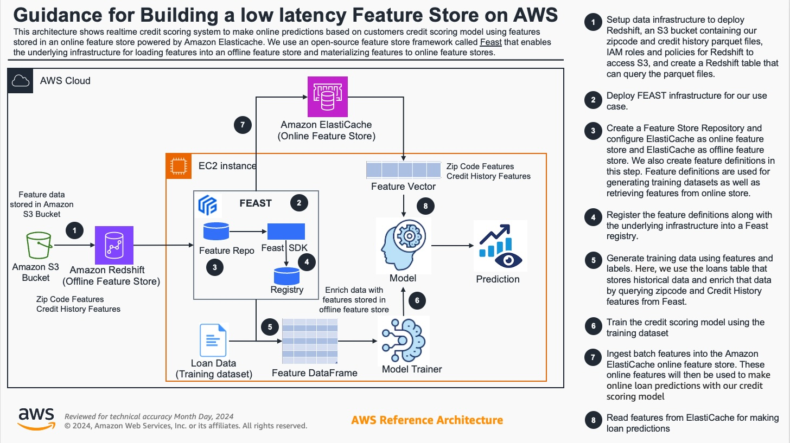

# Real-time Credit Scoring with Feast on AWS

## Overview



This tutorial demonstrates the use of Feast as part of a real-time credit scoring application.
* The primary training dataset is a loan table. This table contains historic loan data with accompanying features. The dataset also contains a target variable, namely whether a user has defaulted on their loan.
* Feast is used during training to enrich the loan table with zipcode and credit history features from a S3 files. The S3 files are queried through Redshift.
* Feast is also used to serve the latest zipcode and credit history features for online credit scoring using DynamoDB.

## Requirements

* AWS CLI (v2.2 or later)

Install project specific dependencies
```
pip install -r requirements.txt
```

## Setup
Run deploy.sh in your terminal. This will spin up the required resources in 'us-west-2' account

```
./deploy.sh
```

You should see outputs in the cloudformation stack

Next we create a mapping from the Redshift cluster to the external catalog
```
aws redshift-data execute-statement \
    --region us-west-2 \
    --cluster-identifier "SET YOUR redshift_cluster_identifier HERE" \
    --db-user admin \
    --database dev --sql "create external schema spectrum from data catalog database 'dev' iam_role \
    'SET YOUR redshift_spectrum_arn here' create external database if not exists;"
```

To see whether the command was successful, please run the following command (substitute your statement id)
```
aws redshift-data describe-statement --id "SET YOUR STATEMENT ID HERE" --region "us-west-2"
``` 

You should now be able to query actual zipcode features by executing the following statement
```
aws redshift-data execute-statement \
    --region us-west-2 \
    --cluster-identifier "SET YOUR redshift_cluster_identifier HERE" \
    --db-user admin \
    --database dev --sql "SELECT * from spectrum.zipcode_features LIMIT 1;"
```
which should print out results by running
```
aws redshift-data get-statement-result --id "SET YOUR STATEMENT ID HERE" --region "us-west-2"
```

Return to the root of the credit scoring repository
```
cd ..
```

### Setting up Feast

Install Feast using pip

```
pip install 'feast[redis]'
```

We have already set up a feature repository in [feature_repo/](feature_repo/). It isn't necessary to create a new
feature repository, but it can be done using the following command
```
feast init -t aws feature_repo # Command only shown for reference.
```

Since we don't need to `init` a new repository, all we have to do is configure the 
[feature_store.yaml/](feature_repo/feature_store.yaml) in the feature repository. Please set the fields under `online_store` with the redis endpoint that you got at first step
Set `offline_store` to the configuration you have received when deploying your Redshift cluster and S3 bucket.

Make sure to update the `offline_store` values like:
```
    s3_staging_location: s3://demo-feast-project-aws-bucket/*
    iam_role: arn:aws:iam::<enter-your-account-id>:role/s3_spectrum_role
```

Deploy the feature store by running `apply` from within the `feature_repo/` folder
```
cd feature_repo/
feast apply
```
```
Registered entity dob_ssn
Registered entity zipcode
Registered feature view credit_history
Registered feature view zipcode_features
Deploying infrastructure for credit_history
Deploying infrastructure for zipcode_features
```

Next we load features into the online store using the `materialize-incremental` command. This command will load the
latest feature values from a data source into the online store.

```
CURRENT_TIME=$(date -u +"%Y-%m-%dT%H:%M:%S")
feast materialize-incremental $CURRENT_TIME
```

Return to the root of the repository
```
cd ..
```

## Train and test the model

Finally, we train the model using a combination of loan data from S3 and our zipcode and credit history features from Redshift
(which in turn queries S3), and then we test online inference by reading those same features from DynamoDB 

```
python run.py
```
The script should then output the result of a single loan application
```
loan rejected!
```

## Interactive demo (using Streamlit)

Once the credit scoring model has been trained it can be used for interactive loan applications using Streamlit:

Simply start the Streamlit application
```
streamlit run streamlit_app.py
```
Then navigate to the URL on which Streamlit is being served. You should see a user interface through which loan applications can be made:

